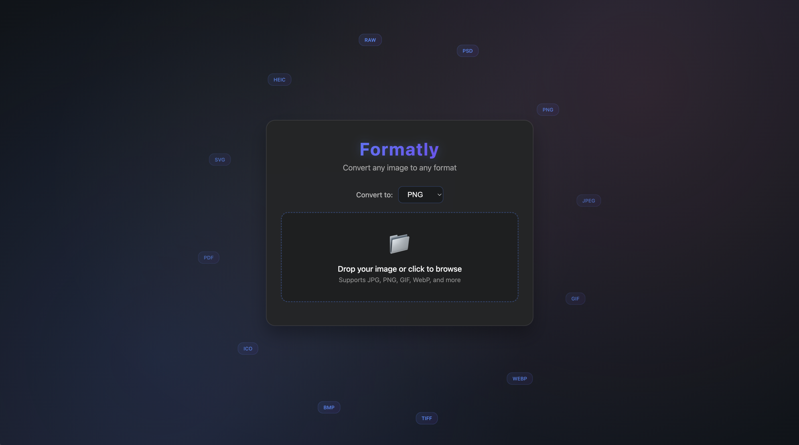
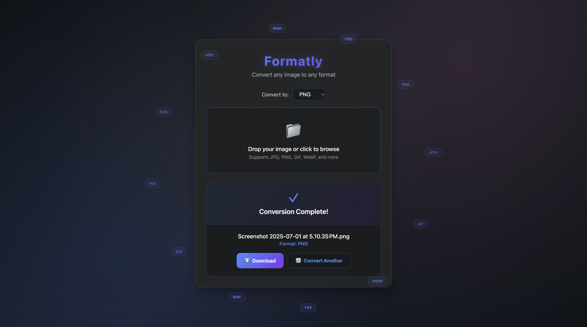

# Formatly

A web application for converting images between different formats.

## Interface Preview

<div align="center">





</div>

## Supported Formats

**Common:** PNG, JPEG, JPG, GIF, BMP, TIFF, WEBP, ICO, TGA, PCX

**Advanced:** HEIC, RAW, PSD, EXR, SVG, EPS, PDF, AI, CDR, APNG, SVGZ, DDS, JFIF, AVIF, PIC, XCF, DNG

*Advanced formats require ImageMagick*

## Installation

### Prerequisites
- Python 3.8+
- ImageMagick (optional, for advanced formats)

### Setup

```bash
git clone https://github.com/colepuls/Formatly.git
cd Formatly
pip install -r requirements.txt
python3 app.py
```

Open http://localhost:5001

### ImageMagick Installation

**macOS:**
```bash
brew install imagemagick
```

**Ubuntu/Debian:**
```bash
sudo apt-get install imagemagick
```

**Windows:**
Download from [ImageMagick Downloads](https://imagemagick.org/script/download.php#windows)

## Usage

1. Upload an image by dragging or clicking
2. Select output format
3. Click convert
4. Download converted image

## Project Structure

```
Formatly/
├── app.py              # Main application
├── image_converter.py  # Conversion logic
├── templates/
│   └── index.html     # Web interface
└── requirements.txt   # Dependencies
```

---

**Made by Cole Puls**
