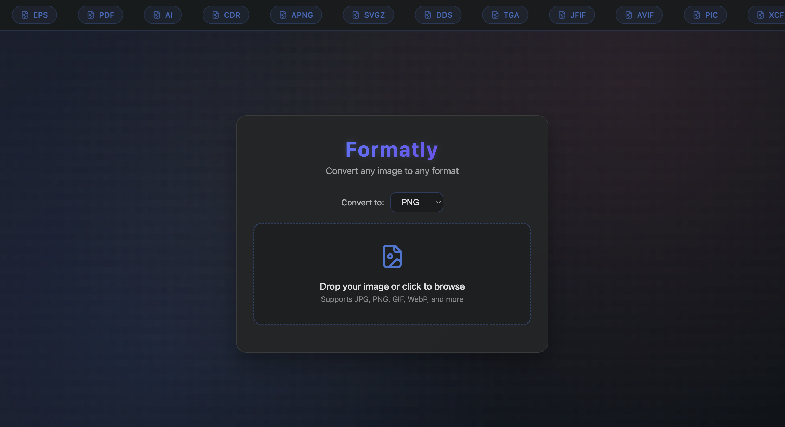
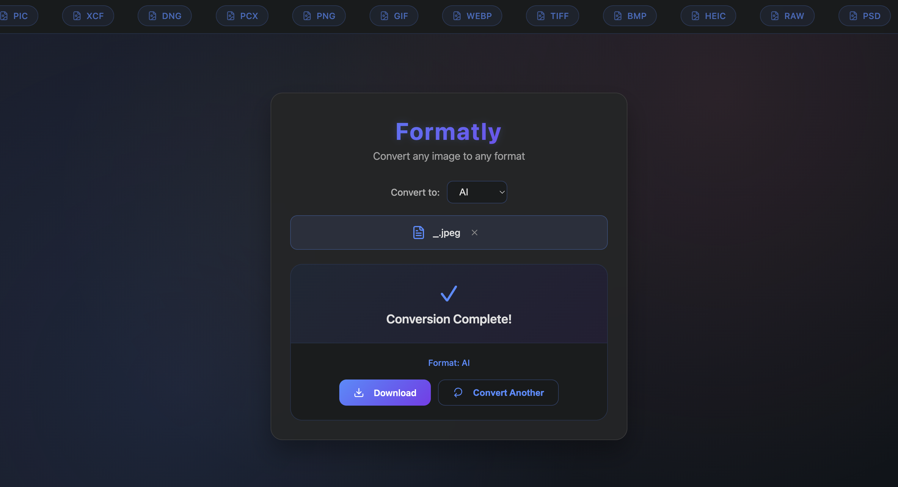

# Formatly

A web application for converting images between different formats.

## Why I Built Formatly

I created Formatly out of personal frustration with existing image conversion tools. Many of them are cluttered with ads, require unnecessary clicks, or hide key features behind paywalls. I wanted a clean, fast, ad-free tool that I could trust and use regularly without hassle.

As someone who often needs to convert images for website submissions, projects, and platform compatibility, I realized a lot of people likely face the same issue. Formatly is built to be simple and functional, no distractions, just quick file conversions.

## Scalability

Formatly is designed with scalability in mind:

- **Modular Backend**: The image conversion logic is separated into its own module, making it easy to extend support for additional formats or processing features.
- **Flask API-Ready**: The app can easily be adapted into a RESTful API for integration with other applications or services.
- **Authentication & Storage (Future Scope)**: With minor additions, Formatly could support user accounts, saved conversion history, cloud storage, and usage analytics.
- **UI Enhancements**: The current frontend is built with vanilla JS, but could be migrated to React or another framework for a more dynamic experience.
- **Performance Optimization**: The current architecture supports easy integration of caching, CDN, and load balancing for high-traffic scenarios.

Whether used as a personal tool or expanded into a public service, Formatly is built to grow.

## Live Demo

**Try it online:** [https://web-production-1acc.up.railway.app/](https://web-production-1acc.up.railway.app/)

## Technology Stack

<div align="center">


**Backend:** Python, Flask, Pillow (PIL), Gunicorn  
**Frontend:** HTML5, CSS3, Vanilla JavaScript  
**Image Processing:** Pillow + ImageMagick 

</div>

## Interface Preview

<div align="center">





</div>

## Supported Formats

**Common:** PNG, JPEG, JPG, GIF, BMP, TIFF, WEBP, ICO, TGA, PCX

**Advanced:** HEIC, RAW, PSD, EXR, SVG, EPS, PDF, AI, CDR, APNG, SVGZ, DDS, JFIF, AVIF, PIC, XCF, DNG

*Advanced formats require ImageMagick*

## Local Development

#### Prerequisites
- Python 3.8+
- ImageMagick (optional, for advanced formats)

#### Setup

```bash
git clone https://github.com/colepuls/Formatly.git
cd Formatly
pip install -r requirements.txt
python3 app.py
```

Open http://localhost:5001

#### ImageMagick Installation

**macOS:**
```bash
brew install imagemagick
```

**Windows:**
Download from [ImageMagick Downloads](https://imagemagick.org/script/download.php#windows)

**Linux (Ubuntu/Debian):**
```bash
sudo apt-get update
sudo apt-get install imagemagick
```

## Usage

1. Upload an image by dragging or clicking
2. Select output format
3. Click convert
4. Download converted image

## Project Structure

```
Formatly/
├── app.py              # Main application
├── image_converter.py  # Conversion logic
├── templates/
│   └── index.html     # Web interface
├── requirements.txt   # Dependencies
└── wsgi.py           # WSGI entry point
```

---

**Made by Cole Puls**
